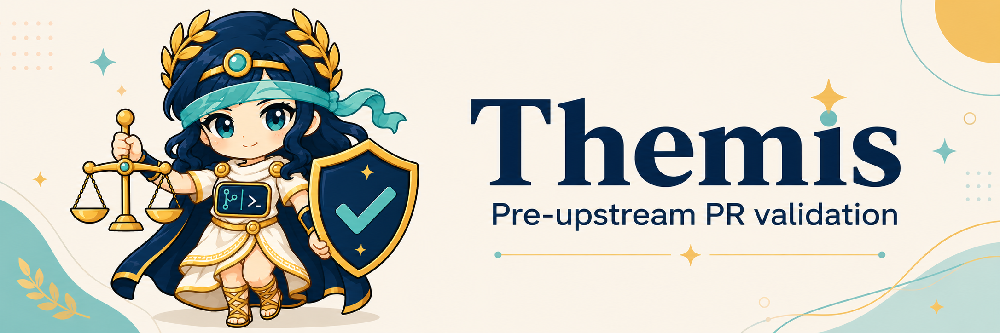

<picture>
  <source media="(prefers-color-scheme: dark)" srcset="docs/assets/themis-banner-dark.png">
  
</picture>

# Themis

Themis is a paranoid pre-upstream assistant and gate for AI-assisted code. It is named for the Greek goddess of law, order, custom, and proper procedure.

It is meant to help contributors prepare upstream-ready work, automate repetitive process checks, and fail closed when a pull request cannot prove it follows the target project's rules.

The tool treats maintainer time as scarce. Its default posture is deliberately strict: unclear provenance, missing tests, missing AI disclosure, generated/vendor noise, suspicious placeholders, ignored upstream rules, one-off feature churn, or unverifiable claims become hard blockers.

Themis is not anti-newcomer. It is meant to protect maintainers and sincere contributors, including new ones, by making upstream expectations explicit before review time is spent. See `docs/mission.md`.

Themis does not take accountability for users. It blocks risky or under-evidenced submissions as best it can, but passing Themis does not certify correctness, security, licensing, maintainability, or upstream acceptance. The submitter remains responsible for the work, and maintainers remain responsible for project review decisions.

## What It Checks

- Always applies the validator's own built-in paranoid safety rules first.
- Dynamically applies target repository rules from `.themis.toml`, contribution docs, PR templates, and policy files.
- Finds upstream rules in files such as `CONTRIBUTING`, `DEVELOPING`, `MAINTAINERS`, `SECURITY`, `LICENSE`, pull request templates, and `.github` policy files.
- Blocks AI-assisted submissions unless the PR text includes explicit `AI assistance:` and `Human accountability:` sections.
- Blocks AI-assisted submissions when project docs appear to forbid AI-generated contributions.
- Infers repo-specific blockers for PR checklist acknowledgement, DCO/signoff, required tests, changelog/release-note handling, issue links, and conventional commit style when the target repo documents those requirements.
- Requires test evidence for code changes and flags code changes with no matching tests.
- Enforces DCO/Signed-off-by expectations when upstream docs mention them.
- Blocks generated, vendored, minified, binary, oversized, secret-looking, placeholder, or AI-slop-looking diff content.
- Produces a Markdown report and exits non-zero when blockers are present. The report is a gate result, not a certification.
- Generates an upstream readiness guide that summarizes detected rules, changed files, likely obligations, and suggested next commands.
- Generates a maintainer packet that groups blockers into contributor-facing feedback and suggested maintainer actions.

## Quick Start

On NixOS or any system with flakes enabled, enter the development shell first:

```bash
nix develop
```

Create starter config and a PR body template in a target repository:

```bash
themis init --repo /path/to/target/repo
```

Diagnose whether the repository and local tools are ready for Themis workflows:

```bash
themis doctor --repo /path/to/target/repo
```

Inspect the effective policy and inferred upstream rules:

```bash
themis rules --repo /path/to/target/repo
```

Inspect configured AI provider backend readiness:

```bash
themis providers --repo /path/to/target/repo
```

Run the combined local readiness workflow:

```bash
themis self-check --repo /path/to/target/repo --base origin/main --body-file pr-body.md --evidence "nix flake check passed" --run-checks
```

Preview explicit provider-backed assistant output without changing gate results:

```bash
themis providers preview --repo /path/to/target/repo --workflow guide --prompt "Summarize what to fix next."
```

Ask Themis to run the gate and organize the upstream prep work for the current change:

```bash
themis guide --repo /path/to/target/repo --base origin/main --body-file pr-body.md --evidence "pytest -q passed" --run-checks
```

Generate maintainer-facing feedback that can be sent back to a contributor:

```bash
themis maintainer-packet --repo /path/to/target/repo --base origin/main --body-file pr-body.md --evidence "pytest -q passed" --run-checks
```

Explain a blocker or warning code during back-and-forth review:

```bash
themis explain missing-test-evidence
```

In GitHub Actions, Themis can annotate blockers and warnings directly in the check UI:

```bash
themis validate --repo . --base origin/main --body-file pr-body.md --evidence "nix flake check passed" --annotations github
```

The GitHub Action also writes the gate output to the workflow Step Summary by default, so maintainers can read blockers and next actions without downloading artifacts.

For bots and dashboards, request machine-readable JSON:

```bash
themis validate --repo . --base origin/main --body-file pr-body.md --evidence "nix flake check passed" --format json
```

For a concise PR comment body, request comment format:

```bash
themis validate --repo . --base origin/main --body-file pr-body.md --evidence "nix flake check passed" --format comment
```

For code scanning/review tooling, request SARIF:

```bash
themis validate --repo . --base origin/main --body-file pr-body.md --evidence "nix flake check passed" --format sarif --output themis.sarif
```

```bash
python -m themis validate --repo /path/to/target/repo --base origin/main --body-file pr-body.md --evidence "pytest -q passed in CI"
```

By default, the validator assumes the patch is AI-assisted. To validate a patch as human-authored, make that explicit:

```bash
python -m themis validate --repo /path/to/target/repo --base origin/main --human-authored --evidence "make test passed"
```

For CI usage, write a report artifact:

```bash
themis \
  validate \
  --repo . \
  --base origin/main \
  --body-file "$PR_BODY_FILE" \
  --evidence-file validation/test-evidence.txt \
  --output upstream-validation-report.md
```

You can also run the packaged CLI directly through the flake:

```bash
nix run . -- validate --repo /path/to/target/repo --base origin/main --body-file pr-body.md --evidence "pytest -q passed"
```

Project verification is intentionally Nix-first:

```bash
nix flake check
```

Before releases, verify version consistency:

```bash
themis release check
```

## Draft PR

When local work is ready, use the PR draft command. It runs the hard gate, runs configured required checks, writes a validation report, and creates a GitHub draft PR only if there are no blockers.

```bash
nix run . -- pull-request draft --base origin/main --body-file pr-body.md --evidence "nix flake check passed"
```

Short form:

```bash
nix run . -- pr d --base origin/main --body-file pr-body.md --evidence "nix flake check passed"
```

The draft PR body includes the original PR description plus the validator report. The command requires GitHub CLI authentication for draft PR creation.

Equivalent direct validator form:

```bash
nix run . -- pull-request draft --repo . --base origin/main --body-file pr-body.md
```

## CLI Reference

The CLI reference is generated directly from the parser code so docs and implementation stay tied together.

Which command to use:

| Command | Short form | Use when |
| --- | --- | --- |
| `themis validate` | `themis v` | You need the hard gate result for local use or CI. |
| `themis guide` | `themis g` | You are preparing a contribution and want next steps. |
| `themis maintainer-packet` | `themis mp` | You need maintainer-facing feedback/triage notes. |
| `themis pull-request draft` | `themis pr d` | You want Themis to gate the patch and create a GitHub draft PR if clean. |
| `themis self-check` | none | You want doctor, rules, providers, and gate output together. |
| `themis doctor` | none | You need repository/tooling readiness diagnostics. |
| `themis rules` | none | You need effective policy and inferred upstream process rules. |
| `themis providers` | none | You need AI provider configuration diagnostics. |
| `themis config check` | none | You need standalone `.themis.toml` validation. |

`themis check` is intentionally not a command. It duplicates `validate` while also colliding with required checks and `--check` documentation workflows.

```bash
nix run . -- docs cli --write
nix run . -- docs cli --check
```

`nix flake check` runs the generated-docs check, so Themis blocks itself when CLI docs drift from code. See `docs/cli.md`.

Additional docs:

- `docs/configuration.md`: `.themis.toml` policy fields and examples.
- `docs/schema/themis.schema.json`: JSON Schema for `.themis.toml`.
- `docs/cli-style.md`: CLI command/output style rules and naming guidance.
- `docs/github-action.md`: GitHub Action usage and inputs.
- `docs/ai-providers.md`: safe AI backend/provider configuration and roadmap.
- `docs/development.md`: local development and self-check workflow.
- `docs/assets/README.md`: visual concept artwork and future brand asset notes.
- `examples/pr-body.md`: minimal PR body template that includes required accountability sections.
- `examples/github-actions/`: copyable GitHub workflows for validation, PR comments, self-check, and config-check.

## Shell Completion

Generate completion scripts from the installed CLI:

```bash
themis completion bash
themis completion zsh
themis completion fish
```

## GitHub Action

Use this repository as an action in another project after checkout:

```yaml
name: Themis

on: pull_request

permissions:
  contents: read
  pull-requests: read

jobs:
  validate:
    runs-on: ubuntu-latest
    steps:
      - uses: actions/checkout@v4
        with:
          fetch-depth: 0
      - name: Write PR body
        env:
          PR_BODY: ${{ github.event.pull_request.body }}
        run: printf '%s' "$PR_BODY" > pr-body.md
      - uses: OWNER/themis@main
        with:
          base: origin/${{ github.base_ref }}
          body-file: pr-body.md
          run-checks: "true"
```

Draft PR creation from CI is intentionally opt-in and requires `pull-requests: write` plus a valid `GH_TOKEN`.

Exit codes:

- `0`: no blockers
- `2`: one or more hard blockers
- `3`: validator execution/configuration error

## Configuration

Create `.themis.toml` in the target repository to tune thresholds or command evidence.

Validate configuration without running the PR gate:

```sh
themis config check --repo .
```

```toml
[policy]
max_changed_files = 25
max_added_lines = 800
max_deleted_lines = 500
max_file_added_lines = 300
require_upstream_rules = true
require_tests_for_code = true
require_test_changes_for_code = true
block_generated_paths = true
block_vendor_paths = true
block_ai_markers = true
block_placeholders = true

allow_paths = [
  "docs/generated/",
]

required_checks = [
  "nix flake check",
]
```

`required_checks` are only executed during `themis validate --run-checks` or by default during `themis pull-request draft`. If policy defines required checks and they are not run, the submission is blocked; this avoids letting vague claims replace exact upstream-required commands.

## Required PR Disclosure For AI-Assisted Work

The default bot posture assumes AI assistance. The PR description must include sections like:

```markdown
AI assistance: Used for implementation suggestions; all generated code was manually reviewed, edited, and checked against upstream rules.

Human accountability: I understand and take responsibility for every line, including tests, licensing, security, and project policy compliance.
```

The sections cannot be placeholders such as `used`, `yes`, or `N/A`. Test evidence also has to name a command or CI run and say it passed. This is intentionally stricter than many projects. It reflects the current maintainer backlash against low-effort AI submissions and keeps responsibility on the submitter before maintainers spend review time.

## Research Basis

See `docs/ai-upstream-politics.md` for the maintainer/community concerns that shaped the hard-blocking defaults.
