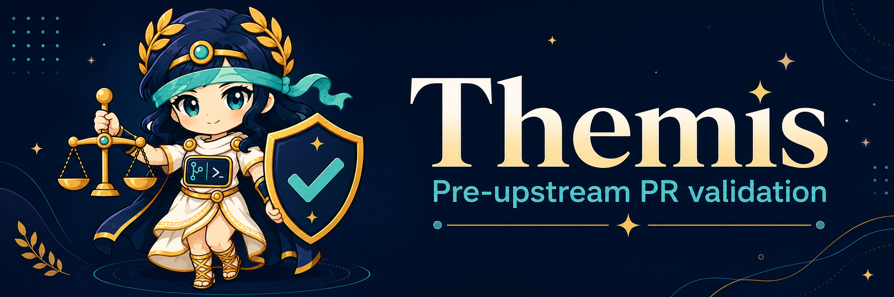
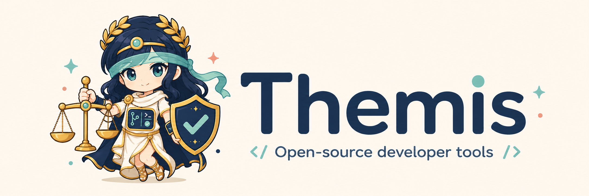
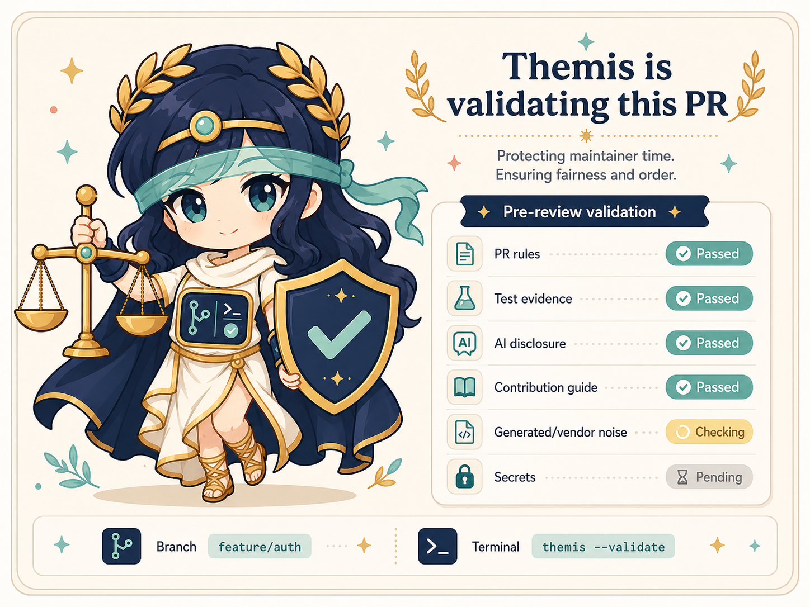
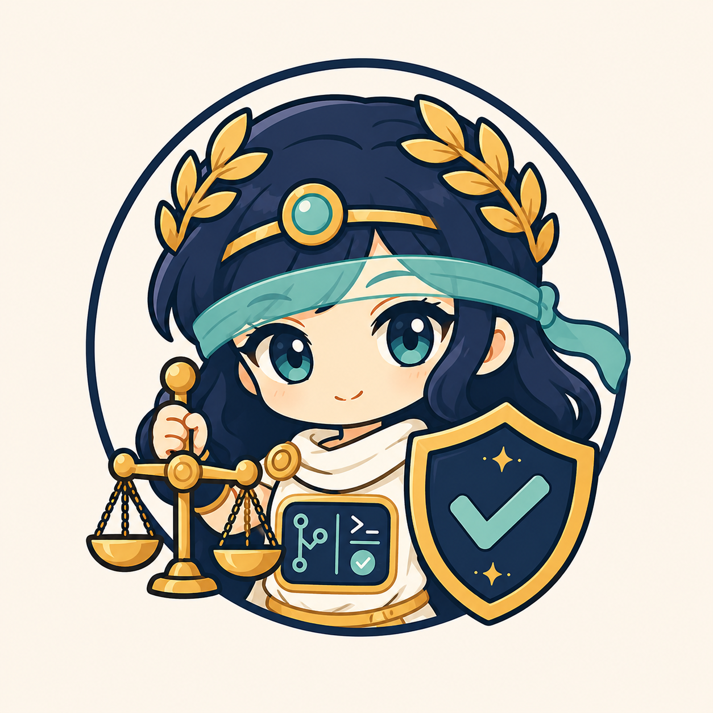
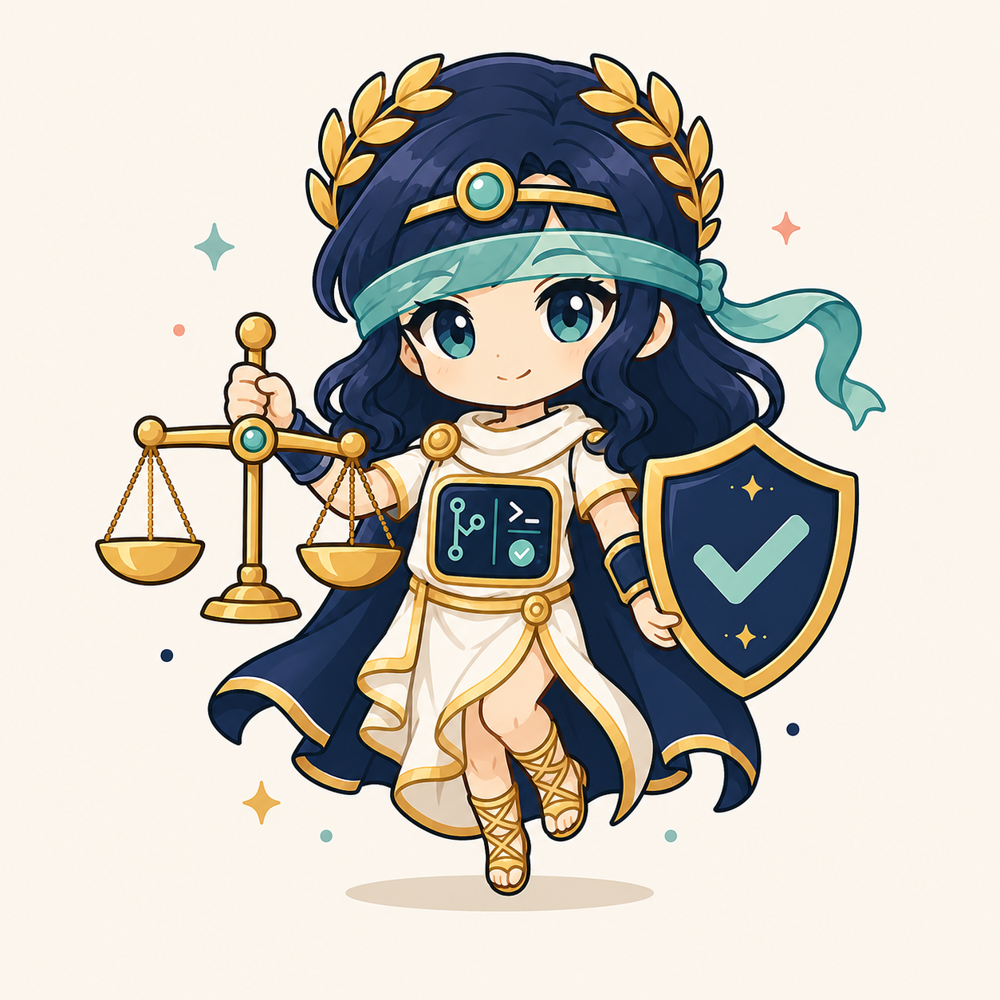

# Themis Visual Assets

The images in `concepts/` are concept artwork for the Themis brand direction. They are not final canonical logos.

Asset provenance and license intent are documented in `PROVENANCE.md`.

They capture the intended mood for future project artwork:

- Cute but serious.
- Maintainer-protective.
- Pre-review validation focused.
- Themis, justice, and order cues.
- Developer tooling cues.

Before using these as official logos, create final assets with clear licensing, transparency where needed, and simplified SVG variants for small-size use.

## Current Usable Assets

These generated assets are usable now because their backgrounds are intentional and their text is readable.

### Light Banner

### Dark Banner

### Validation Card

## Asset TODO

These files are useful style references, but should not be treated as ready official transparent assets yet:

- `themis-primary-mascot.png`: replace with a real transparent-alpha mascot image.
- `themis-compact-icon.png`: replace with a real transparent-alpha compact icon.
- SVG logo/icon variants: create simplified hand-authored versions for small-size use.
- Favicon source: create after the compact icon direction is finalized.
- Final 1.0 logo/trademark review: complete before treating any raster asset as canonical project branding.

Generation prompts for follow-up work live in `PROMPTS.md`.

## Concept Gallery

### Banner Concept

### Validation Card Concept

### Icon Concept

### Mascot Concept

